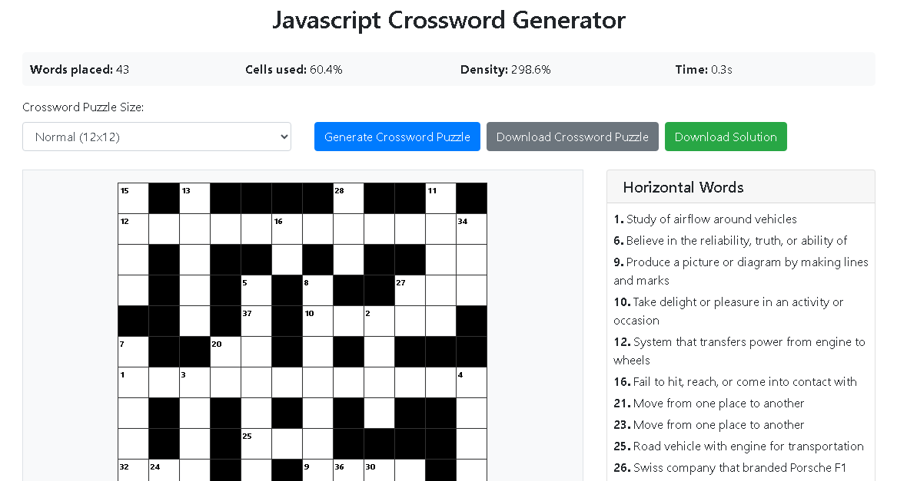
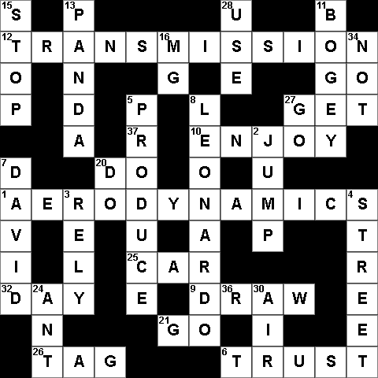

# Crossword Puzzle Generator

A powerful online tool that automatically generates professional crossword puzzles in seconds. Perfect for educators, content creators, and puzzle enthusiasts.

## 🚀 Try Now
[**Live Demo**](https://online-tools.muisca.co/en/tools/generators/crossword-puzzle-generator)



## 📋 Overview

This crossword puzzle generator creates fully-formed crossword puzzles with automatic numbering, clues, and solutions. The tool is completely free, requires no registration, and works directly in your browser.

## ✨ Features

- **Multiple Sizes**: Generate puzzles in 8x8, 12x12, or 15x15 grids
- **Automatic Numbering**: Smart numbering system for across and down clues
- **Complete Solutions**: Includes both puzzle and solution downloads
- **Responsive Design**: Works perfectly on desktop and mobile devices
- **No Registration**: Completely free with no sign-up required
- **Instant Generation**: Create puzzles in seconds with one click

## 🎯 Use Cases

- **Educators**: Create educational materials for classrooms
- **Publishers**: Generate content for newspapers and magazines
- **Content Creators**: Make engaging puzzles for websites and social media
- **Event Organizers**: Create custom puzzles for events and activities
- **Puzzle Enthusiasts**: Generate unlimited puzzles for personal enjoyment



## 🛠️ Technical Details

### Algorithm
The generator uses a sophisticated three-phase placement algorithm:
1. **Initial Placement**: Core word placement with strategic positioning
2. **Long Word Optimization**: Fills larger spaces with appropriate words
3. **Short Word Integration**: Maximizes grid density with smaller words

### Technology Stack
- **Frontend**: Pure HTML, CSS, and JavaScript
- **Styling**: Bootstrap 4 for responsive design
- **Export**: Canvas-based PNG generation for high-quality downloads
- **Compatibility**: Works on all modern browsers

### Key Features
- **Grid Validation**: Ensures all intersecting words are valid
- **Connectivity Check**: Maintains single connected puzzle component
- **Word Database**: Extensive curated word list with definitions
- **Optimized Placement**: Minimizes empty spaces and maximizes word count

## 📥 Installation & Usage

No installation required! Simply visit the live demo link above and start generating puzzles immediately.

For local development:
```bash
git clone https://github.com/sysmaya/javascript-crossword-generator.git
cd crossword-generator
# Open index.html in your browser
